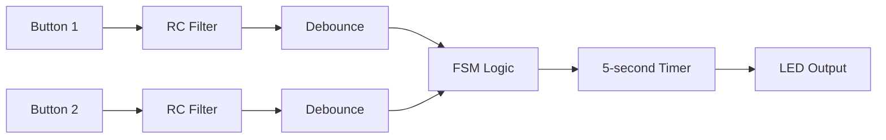

# dual-button-led-debounce

**Author:** Ali Sbeity  
**Version:** 1.0  
**Copyright:** (c) 2026 Ali Sbeity  
**License:** MIT License  

Simultaneous dual button LED control with hardware (RC) and software debounce, FSM based logic, and 5-second timed activation


# Simultaneous Dual-Button LED Activation with Hardware & Software Debounce

### A Robust Embedded Input Handling Case Study  


## Project Overview

This project implements a synchronized dual-button activation system using an Arduino-based microcontroller.

The LED turns ON for exactly 5 seconds only when both push-buttons are pressed simultaneously, and then turns OFF automatically. The system prevents retriggering until both buttons are released.

Although functionally simple, this project is intentionally designed as a reliable embedded input handling case study, integrating:

- Hardware debounce (RC filter)
- Software debounce (time-based digital filtering)
- Finite State Machine (FSM) architecture
- Non-blocking timing
- Tolerance-aware design
- Frequency-domain reasoning


## Demonstration Vedio

A short demonstration of the system in operation is available here:  
[LinkedIn](https://www.linkedin.com/posts/ali-sbeity-r_this-video-presents-one-of-the-initial-foundation-ugcPost-7433305125256941568-KvtH?utm_source=share&utm_medium=member_android&rcm=ACoAAGUK5TkB6mFIkhRXEggy5uv9bPej4WMnw2c)  

[Youtube](https://youtube.com/shorts/VHrAkLY_VjY?si=Tn8KCTUbMnPu65Ma)

The video shows:
- Simultaneous button activation
- Stable LED triggering
- 5-second timed operation
- Retrigger prevention behavior


## System Specification
### Functional Requirements

- Two buttons must be pressed simultaneously.
- LED turns ON for 5 sec)onds.
- LED turns OFF automatically after 5 seconds.
- No retriggering whilehttps://youtube.com/shorts/VHrAkLY_VjY?si=Tn8KCTUbMnPu65Ma buttons remain pressed.
- System returns to IDLE only after both buttons are released.


## System-Level Architecture


This layered architecture increases robustness:
- Hardware layer reduces high-frequency noise.
- Software layer confirms stable logical transitions.
- FSM guarantees deterministic system behavior.


## Mechanical Bounce Analysis

Mechanical push-buttons typically exhibit bounce durations of:
5 ms to 20 ms

During state transitions, the signal oscillates rapidly:
1 0 1 0 1 1 0 1 ...

Without filtering, the MCU may interpret a single press as multiple events.

## Hardware Debounce Design (RC Filter)
### Time Constant

The RC time constant:  

τ = RC  

voltage response (discharge model):  

v(t) = v0 e^{-t/RC}  

At:  

t = τ  

Voltage changes approximately 63% toward its final value.

### Internal Pull-up Consideration

The system uses the internal pull-up resistor of:
Arduino Uno (ATmega328P)
Typical pull-up range:

R(pull-up) = 20KΩ to 50KΩ

This introduces significant tolerance variation.


### Capacitor Selection

Chosen capacitor:

C = 100nF

Now calculate τ range:

Minimum case:

R = 20KΩ => τ = 2ms => τ = 10ms

Maximum case:

R = 50KΩ => τ = 5ms => τ = 25ms

Thus:

5τ = [10ms, 25ms]

Measured bounce range:

5ms – 20ms

Therefore, the selected 100nF capacitor safely covers the bounce interval even under pull-up tolerance variation.

This is a tolerance-aware hardware design decision, not an arbitrary component choice.


## Digital Threshold Consideration

Digital input switching thresholds are approximately:

V{IH} ≈ 0.6 Vcc  
V{IL} ≈ 0.3 Vcc

Solving for charging case:

v(t) = Vcc {1 - e^{-t/τ}  

When:

V(t) = 0.6 Vcc  
t ≈ 0.92τ

Meaning logic transition occurs near one τ — not at 5τ.

This reinforces that RC filtering effectively suppresses short bounce spikes.


## Frequency-Domain Perspective

First-order RC filter transfer function:

H(jw) = 1/(1 + jwRC)

Cutoff frequency:

fc = 1/(2πRC)

Using nominal:

τ = 3ms
fc ≈ 53Hz


Bounce oscillations often contain components in the hundreds of Hz range.

Thus, the RC filter significantly attenuates high-frequency bouncing.


## Software Debounce

A time-based digital debounce algorithm confirms signal stability for 50ms before updating logical state.

This acts as a discrete-time low-pass filter on binary input signals.

Software debounce complements hardware filtering, forming a layered robustness strategy.


## Finite State Machine (FSM) Design

States:
- IDLE
- LED_ON
- WAIT_RELEASE

### State Transitions
IDLE → LED_ON
When both buttons stable LOW

LED_ON → WAIT_RELEASE
After 5 seconds

WAIT_RELEASE → IDLE
When both buttons released

This prevents:
- Continuous retriggering
- Timer reset while holding buttons
- Uncontrolled behavior

The system is edge-triggered with lockout protection.


## FSM Implementation Snippet

Below is a simplified excerpt of the state machine implementation demonstrating deterministic behavior and retrigger protection:

```cp

switch (currentState) {

  case IDLE:
    if (button1.stableState == LOW &&
        button2.stableState == LOW) {

      digitalWrite(ledPin, HIGH);
      ledStartTime = millis();
      currentState = LED_ON;
    }
    break;

  case LED_ON:
    if (millis() - ledStartTime >= timerDuration) {
      digitalWrite(ledPin, LOW);
      currentState = WAIT_RELEASE;
    }
    break;

  case WAIT_RELEASE:
    if (button1.stableState == HIGH &&
        button2.stableState == HIGH) {
      currentState = IDLE;
    }
    break;
}
```

## Full source code:  

The complete Arduino sketch for this project is provided below.  
You can view or download the code from the file: [dual_button.ino](https://github.com/Ali-Sbeity/dual-button-led-debounce/blob/main/dual_button.ino)

The code includes:  
- Reading input from two push-buttons
- RC filter and software debounce implementation
- FSM logic for Synchronized LED activation
- 5-second timer control for the LED


## Non-Blocking Timing

Instead of using delay(5000), the system uses:

t(current) - t(start) ≥ 5000ms

This allows:
- Real-time compatibility
- Scalability
- RTOS readiness
- Deterministic timing behavior


## Design Philosophy

This project demonstrates:
- Quantitative hardware design
- Worst-case tolerance analysis
- Exponential response modeling
- Frequency-domain reasoning
- Digital signal conditioning
- Formal state-machine implementation
- Embedded software architecture discipline


## Why This Is More Than “LED with Two Buttons”

Although simple in functionality, the project illustrates:

Reliable embedded input system design under uncertainty.

It is intentionally structured as a mini embedded systems engineering case study rather than a beginner microcontroller exercise.


## Hardware Summary

- Arduino Uno (ATmega328P)
- Internal pull-up resistors
- 100nF capacitor per button
- LED with current-limiting resistor


## Conclusion

This project demonstrates how even a basic digital interaction can be transformed into a robust, analytically justified embedded system through:
- Mathematical modeling
- Hardware-software co-design
- State-based architecture
- Quantitative reasoning

It reflects engineering methodology rather than trial-and-error implementation.


## Hardware Schematic

The complete circuit schematic, including RC debounce network and wiring configuration, is available here: [schematic](https://github.com/Ali-Sbeity/dual-button-led-debounce/blob/main/Schematic.png)


**Copyright:** (c) 2026 Ali Sbeity  
**License:** MIT License
